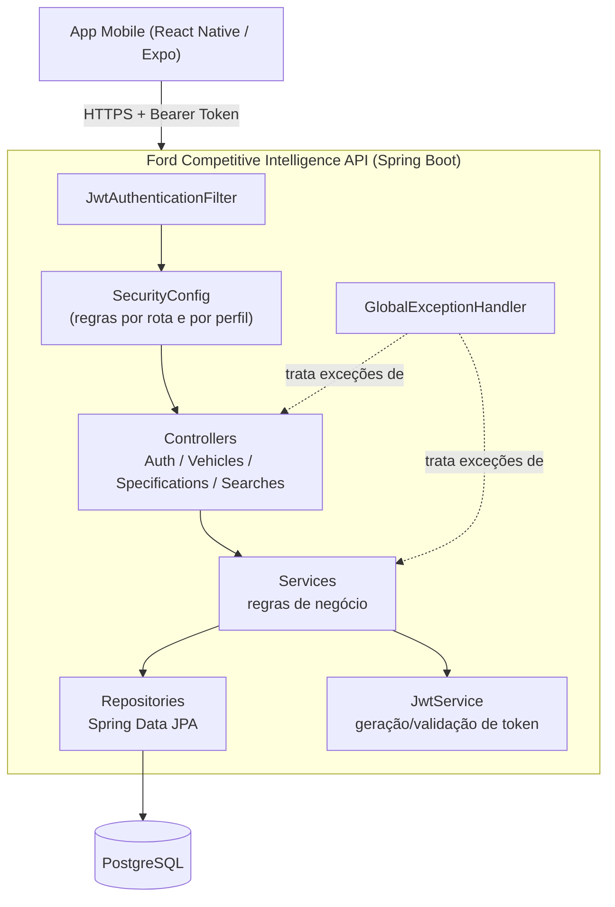
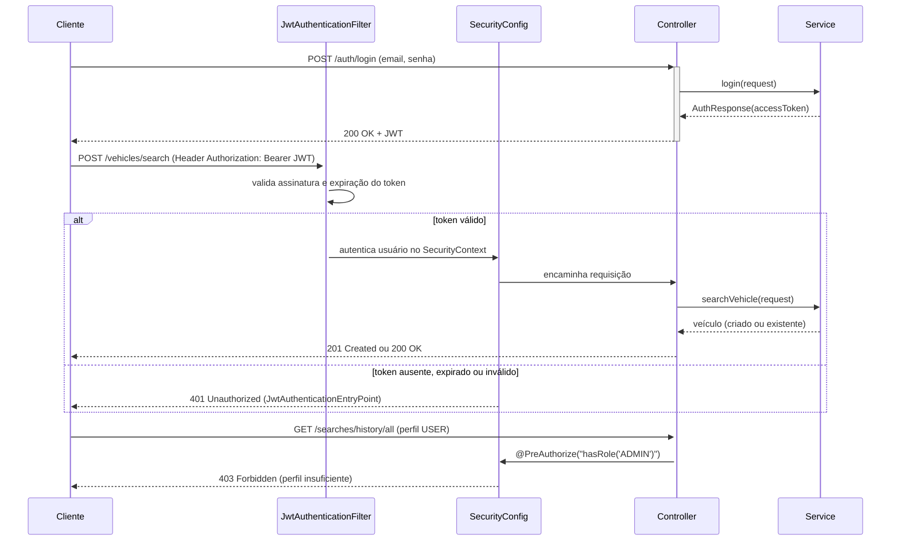
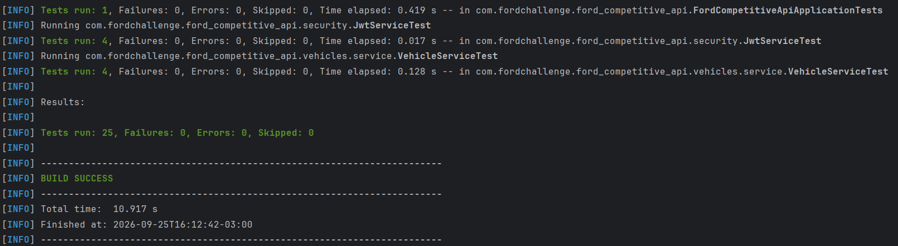

# Ford Competitive Intelligence API

## Entregas por branch

| Branch | Disciplina | Conteúdo |
|---|---|---|
| [`main`](https://github.com/fecarioba/ford-competitive-api/tree/main) | Arquitetura Orientada a Serviços (SOA) e Web Services | API da Sprint 3: arquitetura, autenticação JWT, autorização por perfil, endpoints REST, testes e documentação. |
| [`codex/sprint3-api-security`](https://github.com/fecarioba/ford-competitive-api/tree/codex/sprint3-api-security) | Cybersecurity | Mesma base da API, acrescida das medidas de segurança descritas em [Segurança — diferenças desta branch](#Segurança). |

Este README documenta a branch de **Cybersecurity**. Para entregar apenas a API da disciplina de SOA e Web Services, use a branch `main`; para a entrega de Cybersecurity, use `codex/sprint3-api-security`.

---

# Equipe

- Djalma Moreira de Andrade Filho - RM 555530
- Felipe Paes de Barros Muller Carioba - RM 558447
- Lucas Rodrigues de Queiroz - RM 556323
- Matheus Gushi Morioka - RM 556935
- Victor Hugo de Paula - RM 554787

---

# Sobre o Projeto

A Ford Competitive Intelligence API é uma API REST desenvolvida para o projeto acadêmico FIAP + Ford Challenge.

O objetivo da plataforma é permitir que usuários pesquisem veículos automotivos e visualizem especificações técnicas de maneira organizada, segura e escalável.

Na Sprint 1, o foco foi o desenvolvimento de um MVP profissional contendo autenticação JWT, persistência em PostgreSQL, busca de veículos, histórico de pesquisas, documentação Swagger e arquitetura em camadas.

Na **Sprint 3 (disciplina de Arquitetura Orientada a Serviços e Web Services)**, o projeto foi **refatorado** para atender integralmente aos critérios de avaliação da entrega, mantendo a identidade original (pacotes, convenções de nomes e domínios). As mudanças estão detalhadas na seção [Sprint 3 — O que mudou nesta refatoração](#sprint-3--o-que-mudou-nesta-refatoração).

As melhorias específicas da entrega de Cybersecurity foram feitas sobre essa base e estão documentadas separadamente abaixo.

As funcionalidades de IA, scraping e Google Dorking ainda não foram implementadas, permanecendo apenas preparadas arquiteturalmente para futuras evoluções do projeto (ver Sprint 3 de Inteligência Artificial & Machine Learning).

---

# Segurança

As medidas a seguir foram adicionadas em `codex/sprint3-api-security` sobre a API da branch `main`:

| Área | Alteração na branch de Cybersecurity | Finalidade |
|---|---|---|
| Segredos e banco | `DB_PASSWORD` e `JWT_SECRET` são variáveis de ambiente obrigatórias, sem senhas ou chaves de exemplo como fallback. | Evitar credenciais padrão no código e na configuração versionada. |
| JWT | Expiração padrão reduzida de 24 horas para 1 hora; `JWT_EXPIRATION_MS` permite configurar outro prazo. | Reduzir a janela de uso de um token comprometido. |
| Login | `POST /auth/login` aceita até 10 requisições por IP em uma janela de 1 minuto; a 11ª retorna HTTP 429 e `Retry-After`. | Dificultar tentativas repetidas de autenticação. |
| Cadastro e entradas | Senha de cadastro entre 12 e 128 caracteres; limites para nome, e-mail, senha de login e campos da busca de veículos; ano entre 1886 e 2100. | Rejeitar entradas fora dos limites esperados. |
| CORS | Origens web são definidas por `CORS_ALLOWED_ORIGINS`, com `http://localhost:8081` como padrão local; credenciais CORS desabilitadas. | Restringir origens permitidas para clientes web. |
| Histórico de buscas | A gravação exige o usuário autenticado e não ignora silenciosamente falhas ao identificá-lo. | Impedir histórico sem vínculo válido com o usuário. |
| Erros e registros | Exceções inesperadas retornam HTTP 500 com mensagem genérica; logins bem-sucedidos e falhos geram eventos sem registrar senha ou token; SQL verboso está desligado. | Reduzir exposição de detalhes internos e registrar eventos de autenticação. |
| Testes | Casos adicionais verificam HTTP 429 no login e validação do ano na busca; os testes existentes foram ajustados à nova regra de senha. | Cobrir as novas regras da branch. |

O limite de login usa memória local da instância e o endereço remoto da conexão. Em uma implantação com várias instâncias ou atrás de proxy, é necessário configurar a infraestrutura de rede e aplicar um limite compartilhado no gateway ou em armazenamento externo. O CORS afeta navegadores; aplicativos mobile nativos não dependem dele. As medidas da API complementam, mas não substituem, a segurança do aplicativo mobile que a consome.

---

# Sprint 3 — O que mudou nesta refatoração

[#sprint-3--o-que-mudou-nesta-refatoração](#sprint-3--o-que-mudou-nesta-refatoração)

Refatoração feita para atender aos 5 critérios da entrega de **Arquitetura Orientada a Serviços e Web Services**: Arquitetura da Solução, Autenticação e Autorização, JWT, Maturidade REST Nível 2 e Testes Automatizados/Documentação.

| Critério | O que havia | O que foi feito |
|---|---|---|
| Arquitetura | Sem diagrama documentado | Diagrama de componentes e diagrama de sequência da autenticação (Mermaid, nesta seção) |
| Autenticação | JWT gerado, mas nunca validado de fato (exceções de token expirado/inválido não eram tratadas e quebravam com erro 500) | `JwtService.validateAndExtractClaims` valida assinatura e expiração; `JwtAuthenticationFilter` trata token inválido sem derrubar a aplicação |
| Autorização por perfil | `UserRole` (USER/ADMIN) existia na entidade mas **nunca era usada** para restringir nada | `@EnableMethodSecurity` + `@PreAuthorize("hasRole('ADMIN')")` em `/searches/history/all`; leitura pública em `GET /vehicles/**`; demais endpoints autenticados |
| Bug funcional | `VehicleService` sempre gravava o histórico de busca com `user_id` fixo (`1L`), ignorando quem realmente fez a requisição | Histórico agora é vinculado ao usuário autenticado (via `SecurityContextHolder`) |
| Segurança do JWT | Chave secreta *hardcoded* no código-fonte (`JwtService`) | Chave e expiração externalizadas em `application.properties` / variáveis de ambiente |
| Exposição de dados sensíveis | `POST /auth/register` e um eventual `/me` retornavam a entidade `User` inteira, incluindo o hash BCrypt da senha | Criado `UserResponse` DTO — a resposta nunca inclui `senhaHash` |
| Maturidade REST Nível 2 | Todas as respostas usavam HTTP 200, mesmo quando um recurso era criado; erros de negócio, "não encontrado" e credenciais inválidas todos caíam em HTTP 400 | `POST /vehicles/search` retorna 201 + `Location` quando cria um veículo novo, 200 quando já existia; exceções específicas mapeiam para 404 / 401 / 409 / 403 |
| Tratamento de erros | Um único `catch (RuntimeException)` gerando sempre 400, mesmo para "não encontrado" ou "credenciais inválidas" | `GlobalExceptionHandler` com handlers específicos por tipo de exceção e resposta padronizada (`status`, `error`, `message`, `path`, `timestamp`) |
| Testes automatizados | Apenas o teste padrão `contextLoads()`, sem nenhuma verificação real | Testes unitários (`JwtServiceTest`, `AuthServiceTest`, `VehicleServiceTest`) e testes de integração ponta a ponta (`AuthenticationFlowIntegrationTest`) cobrindo sucesso, erro, 401 (sem token) e 403 (perfil incorreto) |
| Documentação Swagger | Configuração básica do OpenAPI, sem descrição por endpoint | `@Tag`/`@Operation` em todos os controllers explicando o que cada endpoint faz e se é público ou protegido |

## Diagrama de Componentes



## Fluxo de Autenticação e Autorização



---

# Tecnologias Utilizadas

## Backend

- Java 21
- Spring Boot
- Spring Security
- JWT Authentication
- Spring Data JPA
- Hibernate
- PostgreSQL
- Swagger / OpenAPI
- Maven

## Arquitetura

- REST API
- Arquitetura em camadas
- DTO Pattern
- Service Layer
- Repository Pattern
- Exception Handler Global
- JWT Security
- Modularização por domínio

---

# Estrutura do Projeto

```txt
src/main/java/com/fordchallenge/ford_competitive_api

├── auth
│   ├── controller
│   ├── dto
│   └── service
│
├── common
│   └── exception
│
├── config
│
├── searches
│   ├── controller
│   ├── dto
│   ├── entity
│   ├── repository
│   └── service
│
├── security
│
├── specifications
│   ├── controller
│   ├── dto
│   └── service
│
├── users
│   ├── controller
│   ├── dto
│   ├── entity
│   ├── repository
│   └── service
│
└── vehicles
    ├── controller
    ├── dto
    ├── entity
    ├── repository
    └── service
````

---

# Funcionalidades Implementadas

## Autenticação JWT

* Registro de usuários
* Login autenticado
* Geração de Bearer Token
* Rotas protegidas com Spring Security

---

## Busca de Veículos

Fluxo implementado:

1. Usuário pesquisa um veículo
2. API verifica se o veículo já existe no banco
3. Se existir:

    * retorna os dados persistidos
4. Se não existir:

    * cria dados mockados
    * salva no banco
    * registra histórico da busca

---

## Histórico de Pesquisas

A API registra:

* usuário
* veículo pesquisado
* termo da busca
* data da pesquisa

---

## Especificações Automotivas

A API retorna:

* potência
* torque
* combustível
* câmbio
* consumo
* fonte dos dados

---

# Banco de Dados

## Tabelas

### users

| Campo      | Tipo      |
| ---------- | --------- |
| id         | Long      |
| nome       | String    |
| email      | String    |
| senha_hash | String    |
| role       | Enum      |
| created_at | Timestamp |

---

### vehicles

| Campo      | Tipo      |
| ---------- | --------- |
| id         | Long      |
| marca      | String    |
| modelo     | String    |
| ano        | Integer   |
| versao     | String    |
| created_at | Timestamp |

---

### vehicle_specs

| Campo       | Tipo      |
| ----------- | --------- |
| id          | Long      |
| vehicle_id  | Long      |
| potencia    | String    |
| torque      | String    |
| combustivel | String    |
| cambio      | String    |
| consumo     | String    |
| fonte_url   | String    |
| created_at  | Timestamp |

---

### search_history

| Campo       | Tipo      |
| ----------- | --------- |
| id          | Long      |
| user_id     | Long      |
| vehicle_id  | Long      |
| termo_busca | String    |
| created_at  | Timestamp |

---

# Como Rodar o Projeto

## Pré-requisitos

Instalar:

* Java JDK 21
* IntelliJ IDEA
* PostgreSQL
* Git

---

## Clonar o Repositório

```bash
git clone LINK_DO_REPOSITORIO
```

---

## Criar Database

No PostgreSQL, criar:

```sql
CREATE DATABASE ford_challenge;
```

---

## Configurar application.properties

Arquivo:

```txt
src/main/resources/application.properties
```

Configuração:

```properties
spring.application.name=ford-competitive-api

# DATABASE
spring.datasource.url=jdbc:postgresql://localhost:5432/ford_challenge
spring.datasource.username=postgres
spring.datasource.password=${DB_PASSWORD}

# JPA / HIBERNATE
spring.jpa.hibernate.ddl-auto=update
spring.jpa.show-sql=false
spring.jpa.properties.hibernate.format_sql=true

# SERVER
server.port=8080
server.address=0.0.0.0

# JWT — nunca deixe o segredo real hardcoded; defina via variável de ambiente em produção
jwt.secret=${JWT_SECRET}
jwt.expiration-ms=${JWT_EXPIRATION_MS:3600000}
app.cors.allowed-origins=${CORS_ALLOWED_ORIGINS:http://localhost:8081}
```

> Antes de iniciar, configure `DB_PASSWORD` e `JWT_SECRET` (uma chave aleatória com pelo menos 32 bytes). Para clientes web, ajuste `CORS_ALLOWED_ORIGINS` à origem exata; clientes mobile nativos não usam CORS. Não versionar os valores dessas variáveis.

---

## Rodar a Aplicação

Executar:

```txt
FordCompetitiveApiApplication.java
```

Se aparecer:

```txt
Started FordCompetitiveApiApplication
```

A API estará funcionando.

---

# Swagger

Documentação disponível em:

```txt
http://localhost:8080/swagger-ui/index.html
```

---

# Autenticação JWT

## Login

### Endpoint

```http
POST /auth/login
```

### Body

```json
{
  "email": "victor@test.com",
  "senha": "SenhaForte2026!"
}
```

### Resposta

```json
{
  "accessToken": "TOKEN_JWT",
  "tokenType": "Bearer"
}
```

---

# Como Consumir Endpoints Protegidos

Enviar header:

```http
Authorization: Bearer TOKEN_JWT
```

---

# Endpoints Disponíveis

Legenda de acesso: 🌐 público (sem token) · 🔒 protegido (qualquer usuário autenticado) · 🔑 exclusivo ADMIN.

## Auth

| Método | Rota | Acesso | Status de sucesso | Principais erros |
|---|---|---|---|---|
| POST | `/auth/register` | 🌐 | 201 Created | 400 (campo inválido) · 409 (e-mail já cadastrado) |
| POST | `/auth/login` | 🌐 | 200 OK | 400 (campo inválido) · 401 (credenciais inválidas) |
| GET | `/auth/me` | 🔒 | 200 OK | 401 (sem token / token inválido) |

---

## Vehicles

| Método | Rota | Acesso | Status de sucesso | Principais erros |
|---|---|---|---|---|
| GET | `/vehicles` | 🌐 | 200 OK | — |
| GET | `/vehicles/{id}` | 🌐 | 200 OK | 404 (veículo não encontrado) |
| POST | `/vehicles/search` | 🔒 | 201 Created (veículo novo, com header `Location`) ou 200 OK (já existia) | 400 (campo inválido) · 401 (sem token) |

---

## Specifications

| Método | Rota | Acesso | Status de sucesso | Principais erros |
|---|---|---|---|---|
| GET | `/specifications/{vehicleId}` | 🌐 | 200 OK | 404 (veículo/especificação não encontrada) |

---

## Search History

| Método | Rota | Acesso | Status de sucesso | Principais erros |
|---|---|---|---|---|
| GET | `/searches/history` | 🔒 | 200 OK (apenas o histórico do usuário autenticado) | 401 (sem token) |
| GET | `/searches/history/all` | 🔑 ADMIN | 200 OK (histórico de todos os usuários) | 401 (sem token) · 403 (perfil sem permissão) |

---

# Tratamento de Erros

Todas as respostas de erro seguem o mesmo formato, produzido pelo `GlobalExceptionHandler`:

```json
{
  "status": 404,
  "error": "Not Found",
  "message": "Veículo não encontrado com id: 999",
  "path": "/vehicles/999",
  "timestamp": "2026-09-23T10:15:30"
}
```

| Status | Quando ocorre |
|---|---|
| 400 Bad Request | Campo inválido (Bean Validation) ou regra de negócio genérica |
| 401 Unauthorized | Login com credenciais inválidas, ou requisição sem token / com token expirado ou malformado |
| 403 Forbidden | Usuário autenticado, mas sem o perfil (role) exigido pelo endpoint |
| 404 Not Found | Recurso (veículo, especificação) não encontrado |
| 409 Conflict | Tentativa de registrar um e-mail já cadastrado |
| 500 Internal Server Error | Erro inesperado não mapeado |

---

# Testes Automatizados

O projeto usa **H2 em memória** para os testes (perfil `test`), então não é necessário PostgreSQL rodando para executá-los.

```bash
./mvnw test
```

Testes incluídos:

- `JwtServiceTest` — geração/validação de token, expiração e rejeição de assinatura adulterada.
- `AuthServiceTest` — registro e login (sucesso e erro: e-mail duplicado, credenciais inválidas).
- `VehicleServiceTest` — busca de veículo existente vs. criação de mock, vínculo do histórico ao usuário autenticado, erro 404.
- `AuthenticationFlowIntegrationTest` — teste ponta a ponta com o filtro de segurança real: fluxo completo de registro→login→uso do token, acesso público sem token, 401 sem token/token inválido, 403 para perfil sem permissão, 404 e 409.

Esta branch acrescenta dois cenários de integração aos testes da entrega da API: limite de requisições no login e rejeição de ano fora dos limites na busca.

## Evidência de Execução dos Testes

Para gerar a evidência, rode o comando abaixo na raiz do projeto (funciona tanto com PostgreSQL parado quanto rodando, já que os testes usam H2 em memória):

```bash
./mvnw clean test
```

No Windows (PowerShell ou CMD), use:

```bash
mvnw.cmd clean test
```

Evidência de execução da base da API (`main`); execute os testes novamente nesta branch para validar as alterações de Cybersecurity:


---

# Integração com React Native

A API foi desenvolvida para futura integração com React Native Expo.

Fluxo esperado:

1. Mobile realiza login
2. API retorna JWT
3. Mobile salva token
4. Mobile envia Bearer Token nas próximas requisições

Exemplo:

```js
headers: {
  Authorization: `Bearer ${token}`
}
```

---

# Coerência com Testing, Compliance & QA

A API atual representa a base funcional do projeto Ford Intelligence Scout descrito na documentação da disciplina de Testing, Compliance & QA.

Nesta Sprint 1 foram implementados:

* API REST funcional
* autenticação JWT
* persistência em PostgreSQL
* histórico de buscas
* respostas JSON padronizadas
* estrutura preparada para integração mobile
* arquitetura escalável para futuras integrações

As funcionalidades de:

* Google Dorking
* Azure OpenAI
* Web Scraping em tempo real
* Cloud Monitoring
* IA para padronização automática

ainda permanecem planejadas para futuras sprints, sendo atualmente representadas por dados mockados e arquitetura preparada para expansão futura.

---

# Preparação para Futuras Sprints

A arquitetura foi preparada para futuras implementações:

* Inteligência Artificial
* Busca Inteligente
* Google Dorking
* Integração com APIs externas
* Cache
* Logs avançados
* Microserviços
* Deploy Cloud
* Docker
* Machine Learning

---

# Licença

Projeto acadêmico sem fins comerciais.
